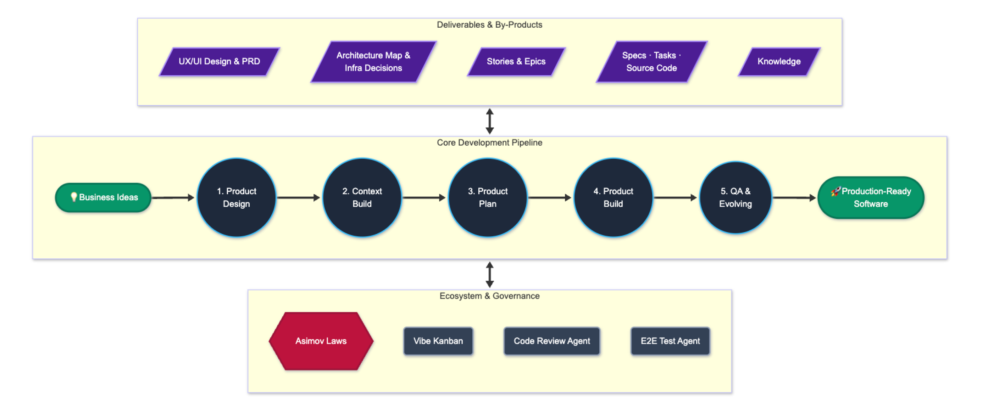
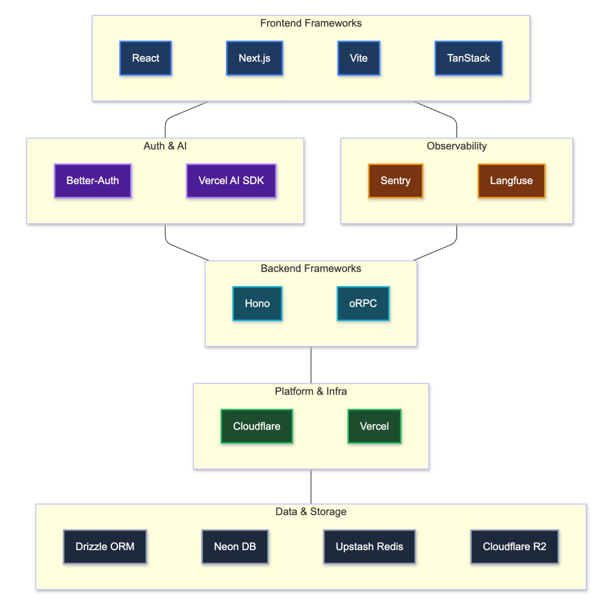
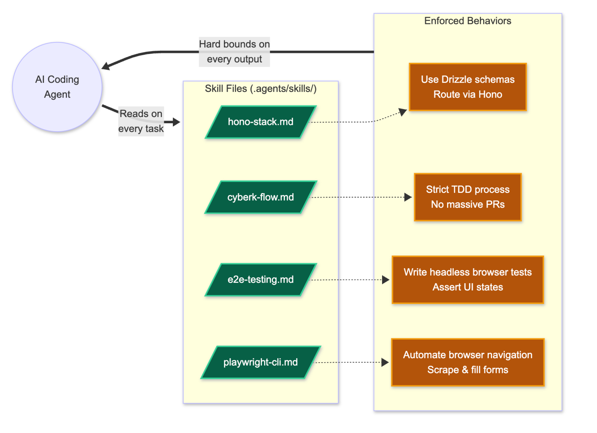
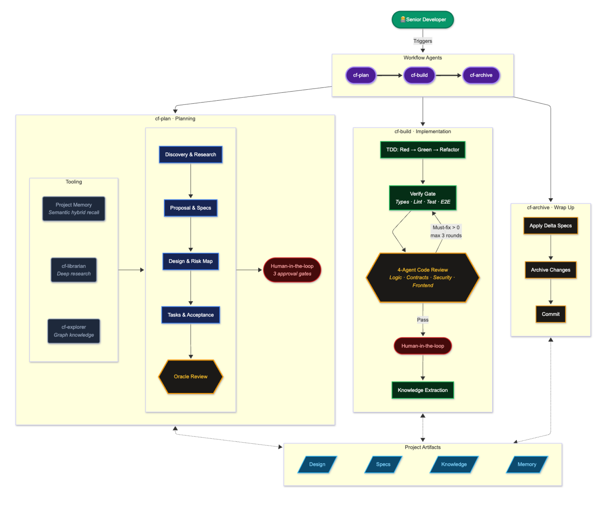

# Asimov Pipeline: Cách Cyberk Sản Xuất Phần Mềm Tiên Tiến

Sự bùng nổ của Trí Tuệ Nhân Tạo (AI) đang thay đổi cách các phần mềm được tạo ra. Tuy nhiên, công nghệ hiện đại cũng mang theo những rủi ro mới đối với tính bền vững của doanh nghiệp.

## 1. Đặt Vấn Đề: Lỗ Hổng Của Việc Ứng Dụng AI Vào Lập Trình Hiện Nay

Việc sử dụng trực tiếp AI (như ChatGPT, Claude) vào việc viết code mang lại tốc độ cao, nhưng đồng thời bộc lộ 3 nhược điểm cốt lõi:

1. **Ảo giác (Hallucinations) & Trượt ngữ cảnh:** Khi làm việc với dự án lớn, AI thường mất kiểm soát kiến trúc ban đầu và tự tạo ra các hàm không tồn tại thay vì báo lỗi.
2. **Xu hướng tối ưu tài nguyên (Token-saving bias):** Các mô hình ngôn ngữ thường ưu tiên tiết kiệm tài nguyên tính toán. Điều này dẫn tới code được viết thiếu chuẩn mực, cắt xén logic, hoặc bỏ qua các trường hợp ngoại lệ (edge-cases) phức tạp.
3. **Sự tích lũy Nợ Kỹ Thuật (Technical Debt):** AI thường viết code chỉ để giải quyết vấn đề trước mắt, tạo ra cấu trúc mã nguồn lộn xộn (spaghetti code) khó kiểm soát lâu dài.

Sự kết hợp giữa những hạn chế này sinh ra hai mô hình lập trình phổ biến nhưng thiếu ổn định hiện nay:

- **Các nền tảng tạo ứng dụng tự động (Ví dụ: Lovable, v0):** Điểm mạnh là sinh ra giao diện và tính năng nhanh chóng. Tuy nhiên, toàn bộ mã nguồn do AI tự động tạo ra thường là một khối nguyên khối (monolithic). Khi nghiệp vụ mở rộng, hệ thống này **rất khó để scale (mở rộng)** và gần như bất khả thi để bảo trì hay thay đổi cục bộ.
- **Phương pháp "Vibe Coding" (Lập trình tương tác với AI):** Nhà phát triển liên tục trò chuyện với AI để sinh code. Dù tốc độ ra tính năng tương đối cao, phương pháp này **tiềm ẩn rủi ro về độ ổn định**. Kiến trúc thường bị đứt gãy do trượt ngữ cảnh, khiến dự án trở nên phụ thuộc hoàn toàn vào 1 hoặc 2 người tham gia ban đầu, gây rào cản lớn cho việc chuyển giao hoặc mở rộng nhân sự sau này.

### Hậu quả đối với Doanh nghiệp

- **Gián đoạn hệ thống (Downtime/Crash) khi vận hành thực tế:** Ứng dụng hoạt động ổn định lúc nghiệm thu, nhưng ngay khi xử lý đồng thời lượng truy cập lớn, hệ thống sẽ rơi vào trạng thái quá tải do giới hạn của thiết kế ban đầu và nợ kỹ thuật.
- **Lãng phí ngân sách vì tháo dỡ và xây lại:** Mã nguồn sinh tự động khuyết thiếu chuẩn mực thường chạm ngưỡng giới hạn phát triển rất nhanh. Doanh nghiệp buộc phải cấp thêm ngân sách khổng lồ để đối tác đập bỏ toàn bộ mã nguồn cũ và thiết kế lại từ đầu.
- **Phụ thuộc nhân sự (Dev lock-in):** Sự thiếu đồng nhất trong quy chuẩn mã nguồn tạo ra rào cản kỹ thuật mù mịt. Khi thay đổi người phát triển, nhân sự tiếp quản không thể đọc hiểu và kế thừa hệ thống.

## 2. Giải Pháp: Định Hướng Production-Ready của Asimov Pipeline

Một phần mềm **đáp ứng tiêu chuẩn đưa vào vận hành thực tế (Production-Ready)** yêu cầu kiến trúc hệ thống rõ ràng, cơ chế tự động cảnh báo lỗi rò rỉ bảo mật, khả năng mở rộng quy mô (scale) theo lưu lượng truy cập, và hệ thống tài liệu minh bạch để dễ dàng chuyển giao.

Đội ngũ Cyberk xây dựng **Asimov Pipeline** để giải quyết bài toán này. Chúng tôi kiểm soát AI bằng các quy tắc khắt khe nhằm đảm bảo hệ thống phần mềm đáp ứng **chuẩn chất lượng quốc tế ISO**:

1. **Hiệu suất & Tối ưu Tài nguyên (Performance Efficiency - ISO 25010):** Đảm bảo tính tối ưu phân rã thuật toán và tài nguyên hạ tầng. Kiến trúc cho phép *mở rộng từ 0 lên 100.000 người dùng*, đồng thời có tính năng tự động chuyển trạng thái "ngủ đông" (Elasticity) để linh hoạt đưa chi phí server về mức không đáng kể khi không có truy cập.
2. **Tính Bảo trì & Phân mảnh Mô-đun (Maintainability & Modularity - ISO 25010):** Khắc phục nhược điểm "nguyên khối", kiến trúc Asimov định hình cấu trúc theo các module độc lập rõ ràng. Điều này cho phép doanh nghiệp thoải mái gỡ bỏ hay nâng cấp tính năng trong tương lai mà không ảnh hưởng tới các thành phần khác.
3. **Độ Tin cậy & Khả năng chịu lỗi (Reliability & Fault Tolerance - ISO 25010):** Mã nguồn bắt buộc kiểm duyệt qua mô hình lập trình kiểm thử (Test-Driven), duy trì tỷ lệ hoạt động chính xác tuyệt đối và loại bỏ triệt để các rủi ro phát sinh từ năng lực "ảo giác" của AI.
4. **An toàn Bảo mật (Security - chuẩn ISO 27001):** Từng đoạn mã nguồn dù tạo ra theo tốc độ từ AI đều trải qua quy trình kiểm duyệt (Audit). Chất lượng thuật toán cuối cùng thực thi bảo mật tương đương sự giám sát khắt khe của chuyên gia hệ thống.

## 3. Phương Pháp Luận Lõi: Context Engineering & Spec-Driven Framework

Để loại bỏ sai sót từ AI, cốt lõi của Asimov Pipeline được thiết kế thông qua tính quy chuẩn hóa dựa trên hai mô hình tiên tiến nhất hiện nay:

**1. Context Engineering (Kỹ thuật Điều khiển Ngữ cảnh):**
Cung cấp định hướng cho AI bằng cách đưa toàn bộ hệ thống tài liệu đặc tả, bản thiết kế sơ đồ, và lịch sử của dự án trước khi lập trình thuật toán làm logic tính năng mới.

- **Kiểm soát "ảo giác" (hallucination):** Ràng buộc AI không làm việc dựa trên suy luận độc lập. AI bắt buộc phải xuất ra kịch bản giải pháp phù hợp với bối cảnh kiến trúc của sản phẩm. Điều này đảm bảo tính đồng nhất mã nguồn được đưa lên mức cao nhất, chuẩn quy tắc kỹ thuật chung của hệ thống.

**2. Spec-Driven Framework (Lập trình hướng Đặc tả):**
Tại quy trình của Cyberk, mọi thay đổi chức năng đều phải đóng gói thành tài liệu **Specs (bản đặc tả kỹ thuật)** chi tiết. AI không được phép tạo tự do bất cứ dòng mã nguồn nào nếu chưa có spec định hình.

- **Phạm vi hóa tác vụ:** Một chỉ tiêu nghiệp vụ kinh doanh được phân rã thành các Specs độc lập. Phương pháp này giúp hệ thống xác định chính xác 100% phạm vi công việc thiết yếu và rạch ròi hướng can thiệp của AI ngay trong quá trình thực thi mà không gây biến tướng dữ liệu.

## 4. Triết Lý Asimov: 3 Định Luật Cho AI Agents

Lấy nguyên bản từ 3 Định luật Robot của nhà khoa học Isaac Asimov, chúng tôi thiết lập "3 Quy Tắc Cốt Lõi" cho mọi AI Agents tham gia quá trình sản xuất. Mục tiêu lớn nhất là luôn chú trọng tính an toàn và sự ổn định để sẵn sàng cho nâng cấp lâu dài:

**Định Luật 1: Tuân thủ Kiến trúc (Architectural Obedience)**

- Agent bắt buộc phải tuân theo Thiết kế Kiến trúc (Architect) tổng thể đã thống nhất. Mọi yêu cầu xử lý logic tiềm ẩn khả năng làm thay đổi không gian hạ tầng dự án sẽ khiến AI phải buộc thông báo và tạm dừng hoạt động. Thay đổi kiến trúc sẽ được chuyên gia đánh giá kỹ càng trước khi quá trình phát triển tự động được tái lập.

**Định Luật 2: Phân bổ và Yêu cầu Kỹ sư (Developer Submission)**

- Agent thực thi chính xác yêu cầu trực tiếp của Kỹ sư điều phối hệ thống, không áp dụng nếu vi phạm Định Luật 1. AI phải đảm bảo nguyên tắc thao tác đủ quy trình: **Tuyệt đối không xử lý thiếu sót** cũng như **không tự ý bổ sung** thêm các thành phần kỹ thuật không nằm trong chỉ định để tối ưu hay cắt gọn dung lượng bộ nhớ.

**Định Luật 3: Tự chủ Vận hành (Autonomous Execution)**

- Agent được quyền đánh giá độc lập để tinh giản mã, phân phối các quyết định để làm nhiệm vụ logic hoặc tiến hành thử nghiệm vận hành tự quản. Quyền hạn này chỉ được phát huy khi các hoạt động đó tuân thủ Định Luật 1 và Định Luật 2.

---

## 5. Pipeline: 5 Bước Sinh Ra Sản Phẩm Chất Lượng Cao

### Bước 1: Product Design (Thiết Kế Trải Nghiệm & Giao Diện)

Kiến trúc sản phẩm lấy người dùng làm trung tâm để đưa ra giao tiếp công nghệ hợp lý.

- **Người thực hiện:** Đội ngũ Nhà thiết kế (Designers), Chuyên gia UX/UI, và Chuyên viên Nghiên cứu (Market Research).
- **Quy trình:** Phân tích nhu cầu doanh nghiệp, nghiên cứu chi tiết hành vi khách hàng qua dữ liệu thị trường và thiết lập luồng thao tác (User Journey).
- **Sản phẩm đầu ra:** Bản vẽ kỹ thuật giao diện (Figma/Sketch), luồng trải nghiệm người dùng (UX), và bản yêu cầu sản phẩm (PRD).

### Bước 2: Context Build (Quyết Định Kiến Trúc & Công Nghệ)

Thiết lập nền móng kỹ thuật và chiến lược công nghệ cho toàn bộ dự án.

- **Người thực hiện:** Quản lý dự án (Project Manager), Kiến trúc sư Hệ thống (Tech Lead/Architect), và Lực lượng Phân tích AI.
- **Quy trình:** Chốt giải pháp công nghệ (Tech Stack), thiết kế cấu trúc hệ thống (Architecture Design), và quy hoạch mô hình AI phù hợp cho từng chuỗi tác vụ. Bước này thiết lập **bộ khung kiến trúc chuẩn mực** — nền tảng cho Định Luật 1 (Tuân thủ Kiến trúc).
- **Sản phẩm đầu ra:** Architecture Design, phân tích rủi ro, lộ trình dài hạn (Master Plan), và khung phân tách danh mục chức năng.

### Bước 3: Product Plan (Bản Đặc Tả Kỹ Thuật)

Chuyển đổi yêu cầu kinh doanh thành ngôn ngữ đặc tả kỹ thuật — điểm giao thoa giữa Người và Máy.

- **Người thực hiện:** Kỹ sư phần mềm kinh nghiệm (Senior Developer) cùng hệ thống AI Planner.
- **Quy trình:** Kỹ sư điều phối AI phân tách dự án theo phương pháp micro-task để xây dựng **Bản đặc tả kỹ thuật (Specs)**. Mỗi Spec phải đạt 3 tiêu chí: (1) Quy trình triển khai chi tiết, (2) Giới hạn nền tảng kỹ thuật, (3) Tiêu chí hoàn thành (Definition of Done).
- **Sản phẩm đầu ra:** Stories & Epics — bản hoạch định chi tiết loại bỏ toàn bộ khoảng trống thông tin cho các bước tự động hóa tiếp theo.

### Bước 4: Product Build (Thực Thi Lập Trình Tự Động)

Triển khai phát triển mã nguồn tự động quy mô lớn theo khung tiêu chuẩn đã định sẵn.

- **Người thực hiện:** Các AI Builder Agents hoạt động dưới giám sát của Kỹ sư (Senior Developer).
- **Quy trình:** Tuân thủ Specs từ Bước 3, AI thực thi theo chu trình **TDD (Test-Driven Development)**: viết test trước → viết code tối thiểu để pass → tái cấu trúc. Mỗi đoạn code phải vượt qua **Verify Gate** (kiểm tra kiểu dữ liệu, linting, test, E2E) và **4-Agent Code Review** (Logic, Contracts, Security, Frontend) trước khi được chấp nhận.
- **Sản phẩm đầu ra:** Mã nguồn chất lượng cao với chứng nhận Passed Testing 100%, cùng Specs và Knowledge được trích xuất tự động.

### Bước 5: QA, Nghiệm Thu & Tiến Hoá Tri Thức

Đánh giá toàn diện và lưu trữ tri thức liên tục cho sự tiến hoá sau bàn giao.

- **Người thực hiện:** Chuyên viên Kiểm duyệt Chất lượng (QA/QC Engineer) cùng AI Audit Agent.
- **Quy trình:** Ngoài kiểm tra bảo mật và hiệu năng qua thao tác thực tế, hệ thống thực hiện đặc tính cốt lõi của Asimov — liên tục đúc kết từ mã nguồn đã triển khai và cập nhật vào **Thư viện tri thức (Knowledge Graph)** của tổ chức. Tri thức này được các AI Agent tái sử dụng trong các dự án tương lai.
- **Sản phẩm đầu ra:** Báo cáo bảo mật theo tiêu chuẩn ISO, và hệ thống AI đã sẵn sàng thích nghi cho các yêu cầu mở rộng tiếp theo.

---

## 6. Hệ Sinh Thái Giám Sát (Ecosystem & Governance)

Hệ thống giám sát tự động hoạt động song song 24/7 xuyên suốt pipeline:

- 🛡️ **Code Review Agent (Kiểm duyệt Mã nguồn):** Hệ thống đa agent tự động rà soát mọi thay đổi mã nguồn qua 4 góc nhìn chuyên biệt — Logic, Contracts, Data Security, và Frontend — phát hiện rủi ro trước khi code được merge.
- 👁️ **E2E Test Agent (Kiểm định Trải nghiệm):** Tự động mô phỏng hành vi người dùng thực tế trên sản phẩm, đảm bảo giao diện và luồng thao tác khớp hoàn toàn với thiết kế ở Bước 1.
- 📊 **Vibe Kanban (Bảng Điều khiển Tiến độ):** Hiển thị minh bạch trạng thái của mọi tác vụ AI đang xử lý, cho phép đội ngũ quản lý theo dõi tiến độ dự án theo thời gian thực.
- 🔒 **Asimov Laws (Bộ Quy tắc AI):** 3 Định Luật cốt lõi (xem Mục 4) được cấu hình trực tiếp vào mọi AI Agent, đảm bảo không có agent nào hoạt động ngoài phạm vi kiến trúc đã phê duyệt.

---

## 7. Nền Tảng Công Nghệ (Technology Stack)

Cyberk lựa chọn bộ công nghệ hiện đại, tối ưu cho kiến trúc serverless và edge computing:

- **Frontend:** React, Next.js, Vite, TanStack — đảm bảo trải nghiệm người dùng mượt mà và hiệu năng cao.
- **Backend:** Hono (web framework siêu nhẹ), oRPC (type-safe RPC) — kiến trúc API gọn gàng, bảo mật.
- **Platform & Infra:** Cloudflare, Vercel — nền tảng serverless/edge cho phép scale từ 0 đến hàng trăm nghìn người dùng với chi phí tối ưu.
- **Auth & AI:** Better-Auth (xác thực), Vercel AI SDK (tích hợp LLM) — sẵn sàng cho các tính năng AI-native.
- **Observability:** Sentry (giám sát lỗi), Langfuse (theo dõi hiệu năng LLM) — phát hiện và xử lý sự cố theo thời gian thực.
- **Data & Storage:** Drizzle ORM, Neon DB (Serverless Postgres), Upstash Redis, Cloudflare R2 — kiến trúc dữ liệu linh hoạt, serverless-native.

---

## 8. AI Skills Framework

Để kiểm soát chặt chẽ hành vi của AI coding agent, Cyberk sử dụng hệ thống **Skill Files** — các tài liệu Markdown được inject trực tiếp vào context của agent trước mỗi tác vụ. Mỗi Skill File định nghĩa:

- **Công nghệ bắt buộc sử dụng:** Ví dụ: phải dùng Drizzle ORM cho database, route qua Hono framework.
- **Quy trình phát triển:** Strict TDD, không cho phép PR quá lớn, tuân thủ cyberk-flow.
- **Tiêu chuẩn kiểm thử:** Viết headless browser test, assert UI states chính xác.
- **Giới hạn hành vi:** Agent không được tự ý thay đổi kiến trúc, bổ sung dependency, hay bỏ qua test.

Hệ thống Skills đóng vai trò **rào cản cứng (hard bounds)** — mọi output của AI đều bị ràng buộc bởi các quy tắc này, loại bỏ hoàn toàn khả năng AI "sáng tạo" ngoài phạm vi cho phép.

---

## 9. Build Workflows: Hệ Thống Agent Tự Động

Quy trình phát triển được điều phối bởi 3 workflow agent, thay thế hoàn toàn quản lý ticket thủ công. Kỹ sư (Senior Developer) đóng vai trò **người điều phối (Director)** — ra lệnh cho agent, phê duyệt tại các cổng kiểm soát, và can thiệp khi cần.

### cf-plan — Hoạch Định

Agent lập kế hoạch qua 5 bước tuần tự: **Discovery & Research → Proposal & Specs → Design & Risk Map → Tasks & Acceptance → Oracle Review**. Trong quá trình này, agent được hỗ trợ bởi:

- **memory-recall:** Truy xuất specs, designs, và knowledge từ các dự án/thay đổi trước đó.
- **cf-librarian:** Nghiên cứu tài liệu, thư viện, và best practices từ nguồn bên ngoài.
- **cf-explorer:** Khám phá codebase qua graph knowledge — thông minh hơn grep/glob thông thường.
- **user-gate:** 3 cổng phê duyệt bắt buộc từ Kỹ sư (phê duyệt hướng đi, specs, và kế hoạch cuối).

Kết thúc bằng **Oracle Review** — agent chuyên phân tích sâu kiểm tra toàn bộ kế hoạch, phát hiện rủi ro và lỗ hổng trước khi chuyển sang giai đoạn thực thi.

### cf-build — Thực Thi

Agent thực thi code theo chu trình **TDD: Red → Green → Refactor** cho từng task. Sau khi hoàn thành, code phải vượt qua:

1. **Verify Gate:** Kiểm tra tự động — Types, Lint, Test, E2E.
2. **4-Agent Code Review:** Bốn agent chuyên biệt (Logic, Contracts, Security, Frontend) rà soát song song. Nếu phát hiện lỗi, vòng lặp sửa-và-review chạy lại (tối đa 3 rounds).
3. **User Gate:** Kỹ sư phê duyệt kết quả cuối cùng.
4. **Knowledge Extraction:** Trích xuất các bài học, quyết định, và patterns từ quá trình build để bổ sung vào Knowledge Graph.

### cf-archive — Lưu Trữ & Đúc Kết

Agent hoàn tất chu trình bằng cách: **Apply Delta Specs** (hợp nhất specs thay đổi vào bộ specs chính), **Archive** (lưu trữ toàn bộ artifacts với timestamp), và **Commit** (một atomic commit duy nhất). Bước Retrospective ghi nhận bài học kinh nghiệm cho các chu trình tiếp theo.

Toàn bộ 3 agents đọc/ghi vào **Project Artifacts** chung (Docs, Specs, Knowledge, Memory) — tạo thành vòng lặp tri thức liên tục, mỗi chu trình sau thông minh hơn chu trình trước.

---

## 10. Tổng Kết: Sự Khác Biệt Khi Ứng Dụng Asimov Pipeline

Sự dịch chuyển từ phương pháp làm phần mềm truyền thống sang Asimov Pipeline mang lại sự thay đổi hoàn toàn về hệ giá trị cốt lõi:

1. **Đảm bảo tự động các tiêu chuẩn quốc tế:** Yếu tố cảm tính trong lập trình được loại bỏ. Cyberk có thể kiểm soát và cam kết thực hành sản phẩm hoàn toàn theo tiêu chuẩn thiết kế kiến trúc ISO 25010 và hệ thống quản lý an toàn thông tin ISO 27001.
2. **Theo đuổi triết lý "Do the right thing":** Đội ngũ chuyên gia không còn bị mắc kẹt vào các công đoạn gõ mã nguồn thủ công lặp đi lặp lại. Tài nguyên thời gian quý giá nhất của Kỹ sư được cấp phát hoàn toàn cho việc đào sâu yêu cầu nghiệp vụ và thiết kế giải pháp (Solution Design).
3. **Tự động hóa sự hoàn hảo (Consistency):** Chất lượng mã nguồn không còn phụ thuộc vào phong độ hay kinh nghiệm của từng cá nhân. Khi toàn bộ quá trình triển khai do AI thực thi dưới khung giới hạn Asimov, sản phẩm cuối cùng đạt được sự đồng nhất 100% trên toàn bộ các khối chức năng. Con người lui về đóng vai trò Kiến trúc sư và Giám sát — đúng vị trí có giá trị cao nhất.
