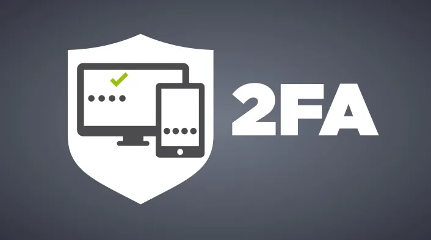

# Quy định về bảo mật thông tin

### 1. Mục Đích

Tài liệu này nhằm cung cấp cho nhân viên mới các kiến thức cơ bản về bảo mật thông tin, giúp họ hiểu rõ tầm quan trọng của việc bảo vệ thông tin và thực hiện các biện pháp bảo mật phù hợp trong quá trình làm việc tại công ty.

<figure><figcaption></figcaption></figure>

### 2. Tầm Quan Trọng Của Bảo Mật Thông Tin

Trong môi trường công ty IT, thông tin là tài sản vô cùng quan trọng. Việc bảo vệ thông tin không chỉ giúp công ty tránh được các rủi ro về an ninh mạng mà còn đảm bảo uy tín và sự tin cậy của khách hàng. Dưới đây là một số lý do bảo mật thông tin là cần thiết:

* **Bảo vệ tài sản trí tuệ và dữ liệu khách hàng**: Dữ liệu bị rò rỉ có thể gây tổn hại nặng nề về mặt tài chính và danh tiếng.
* **Tuân thủ pháp luật**: Nhiều quốc gia và khu vực có các quy định nghiêm ngặt về bảo mật dữ liệu, như GDPR (châu Âu), CCPA (California), và nhiều quy định khác.
* **Ngăn chặn các cuộc tấn công mạng**: Hacker có thể sử dụng dữ liệu bị đánh cắp để thực hiện các cuộc tấn công tiếp theo hoặc tống tiền.

### 3. Các Nguyên Tắc Bảo Mật Cơ Bản

3.1. Sử Dụng Mật Khẩu Mạnh

* **Tạo mật khẩu mạnh**: Mật khẩu phải chứa ít nhất 8 ký tự, bao gồm chữ hoa, chữ thường, số và ký tự đặc biệt.
* **Không sử dụng mật khẩu dễ đoán**: Tránh sử dụng ngày sinh, tên người thân hoặc các chuỗi ký tự phổ biến.
* **Sử dụng phần mềm quản lý mật khẩu**: Các công cụ như LastPass hoặc 1Password sẽ giúp bạn lưu trữ và quản lý mật khẩu một cách an toàn.
* **Thay đổi mật khẩu định kỳ**: Đảm bảo rằng mật khẩu được thay đổi ít nhất mỗi 3-6 tháng.

3.2. Xác Thực Hai Yếu Tố (2FA)

* **Bật 2FA trên tất cả các tài khoản**: Xác thực hai yếu tố giúp tăng cường bảo mật bằng cách yêu cầu một mã xác thực bổ sung ngoài mật khẩu.
* **Sử dụng các ứng dụng xác thực**: Google Authenticator hoặc Authy là những ứng dụng phổ biến cho việc xác thực hai yếu tố.

<figure><figcaption></figcaption></figure>

#### 3.3. Cẩn Trọng Với Phishing

* **Kiểm tra email và liên kết lạ**: Không bấm vào các liên kết trong email từ những nguồn không rõ ràng.
* **Xác minh địa chỉ email**: Đảm bảo rằng email đến từ các nguồn đáng tin cậy, đặc biệt chú ý đến những email yêu cầu cung cấp thông tin cá nhân hoặc tài khoản.

#### 3.4. Bảo Vệ Thiết Bị Cá Nhân

* **Khóa màn hình**: Luôn đặt mật khẩu hoặc khóa vân tay cho máy tính và điện thoại.
* **Cập nhật phần mềm thường xuyên**: Đảm bảo rằng hệ điều hành, phần mềm và ứng dụng của bạn luôn được cập nhật phiên bản mới nhất để vá các lỗ hổng bảo mật.
* **Cài đặt phần mềm chống virus**: Sử dụng các phần mềm chống virus và chống malware để bảo vệ thiết bị khỏi các mối đe dọa từ internet.

### 4. Quy Định Bảo Mật Tại Công Ty

4.1. Chính Sách Sử Dụng Email

* **Không sử dụng email công ty cho mục đích cá nhân**: Email công ty chỉ được sử dụng cho các công việc liên quan đến công ty, tránh gửi thông tin nhạy cảm qua email không mã hóa.
* **Báo cáo các email đáng ngờ**: Nếu nhận được email đáng ngờ, hãy báo cáo ngay cho bộ phận IT để xử lý.

#### 4.2. Truy Cập Hệ Thống

* **Chỉ truy cập hệ thống khi cần thiết**: Tránh đăng nhập vào các hệ thống không liên quan đến công việc của bạn.
* **Không chia sẻ tài khoản cá nhân**: Tuyệt đối không chia sẻ tài khoản người dùng của bạn với bất kỳ ai khác.

#### 4.3. Sử Dụng Mạng

* **Tránh kết nối vào mạng Wi-Fi công cộng**: Chỉ sử dụng mạng Wi-Fi có bảo mật cao hoặc kết nối qua VPN khi làm việc từ xa.

#### 4.4. Sao Lưu Dữ Liệu

* **Sao lưu dữ liệu định kỳ**: Đảm bảo rằng dữ liệu quan trọng được sao lưu thường xuyên vào các hệ thống lưu trữ an toàn của công ty.
* **Không lưu trữ dữ liệu trên thiết bị cá nhân**: Tránh lưu trữ dữ liệu công ty trên thiết bị cá nhân như USB hoặc máy tính cá nhân trừ khi được sự cho phép từ bộ phận IT.

### 5. Xử Lý Sự Cố Bảo Mật

#### 5.1. Phát hiện sự cố bảo mật

Nếu bạn phát hiện bất kỳ dấu hiệu nào của sự cố bảo mật (như email lạ, hệ thống bị tấn công, hoặc thông tin bị rò rỉ), hãy:

1. **Ngay lập tức báo cáo cho bộ phận IT**: Điều này giúp công ty có thể xử lý và ngăn chặn sự cố lan rộng.
2. **Ngừng sử dụng thiết bị bị ảnh hưởng**: Nếu thiết bị của bạn có dấu hiệu bị nhiễm virus hoặc bị hack, hãy ngừng sử dụng ngay và báo cáo sự việc.

#### 5.2. Phản hồi sau sự cố

Sau khi sự cố xảy ra, công ty sẽ tiến hành các bước điều tra và khắc phục. Nhân viên có trách nhiệm hợp tác với bộ phận IT để cung cấp thông tin cần thiết và tuân thủ các hướng dẫn nhằm đảm bảo hệ thống được bảo mật trở lại.

### 6. Kết Luận

\
Bảo mật thông tin không chỉ là trách nhiệm của bộ phận IT mà còn là trách nhiệm của mỗi nhân viên trong công ty. Hy vọng tài liệu này giúp bạn hiểu rõ hơn về các quy định và biện pháp bảo mật cần thiết để bảo vệ thông tin công ty và dữ liệu khách hàng. Việc tuân thủ các nguyên tắc này sẽ giúp chúng ta xây dựng một môi trường làm việc an toàn và chuyên nghiệp.\
**Hãy luôn cảnh giác và bảo vệ thông tin một cách cẩn trọng!**
