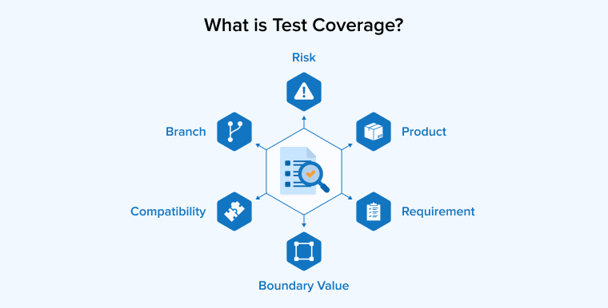

# Thế nào là một bộ testcase tốt?

Để có được một bộ testcase tốt, hãy:

* **Cover tối đa các trường hợp có thể xảy ra:** Hãy đảm bảo bạn nắm rõ tất cả các yêu cầu của khách hàng và thể hiện được chúng trong bộ testcase của mình

<figure><figcaption></figcaption></figure>

* **Tập trung vào các kịch bản quan trọng:** Hãy chắc chắn rằng test case của bạn bao phủ những tình huống có thể gây ra lỗi nghiêm trọng nhất. Ngoài những test case đơn lẻ được mô tả trong tài liệu, hãy cố gắng mô tả các test case mô phỏng các hành động thường gặp của end user. Các test case liên quan đến trigger của hệ thống cũng là một trong số những test case dễ gây lỗi cho sản phẩm(Đừng quên bổ sung chúng nhé!)
* **Giảm thiểu phức tạp**: Test case cần dễ hiểu và rõ ràng. Tránh việc viết test case quá phức tạp hoặc khó hiểu. Hãy viết thành những câu đơn ngắn gọn với cấu trúc đơn giản để một tester mới không hiểu gì về dự án cũng có thể đọc hiểu và thực hiện test.
* **Cập nhật test case**: Nếu có thay đổi trong yêu cầu hoặc tính năng, hãy đảm bảo test case của bạn được cập nhật kịp thời.
* **Bổ sung test case từ bug**: Có rất nhiều bug được tìm thấy trong quá trình free test. Hãy cố gắng bổ sung thêm các test case từ những bug bạn hoặc khách hàng tìm được trong quá trình free test. Điều đó giúp bạn hoàn thiện khả năng viết test case của mình và tránh bỏ xót các bug tương tự trong các sản phẩm tiếp theo

