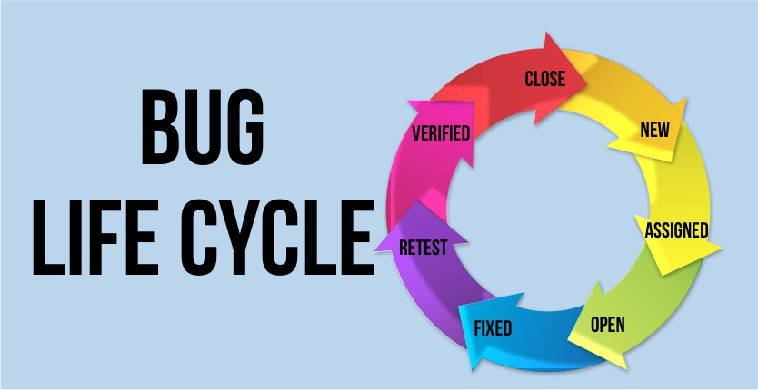

# Bug report

Điều gì tạo nên một Bug report tốt? Bug report của bạn đã đủ tốt chưa? Hãy thử nhìn lại một lượt nhé.

* **Bug title**: Ngắn gọn, xúc tích mà bao trọn được nội dung. Hãy cố gắng đảm bảo các câu hỏi What? How? Where? and When?
* **Assignee:** Gần đến bước cuối cùng rồi. Hãy assign bug cho developer xử lý nó nếu bạn không muốn nó rơi vào quên lãng nhé.
* **Start date:** Ngày Dev bắt đầu thực hiện fix (Dev sẽ tự nhập ở trong bug. Tùy thuộc vào tool mà công ty đang dùng, bạn có thể bổ sung nội dung này nhé)
* **Fixed date:** Ngày kết thúc việc sửa thực tế. (Tùy thuộc vào tool mà công ty đang dùng, bạn có thể bổ sung nội dung này nhé)
* **Deadline:** Ngày hạn phải sửa xong lỗi
* **Điều kiện tiên quyết (Pre-condition):** Điều kiện cần phải có trước khi thực hiện steps.
* **Các bước tái hiện (Steps):** Hầu hết các tester mới thường gặp phải lỗi mô tả bug quá lan man, không đúng trọng tâm khiến cho quá trình điều tra lỗi trở nên khó khăn hoặc mất thời gian hơn. Hãy đảm bảo các step là những bước tối thiểu để có thể tái hiện được bug.
* **Kết quả mong đợi (Expectation) là gì?** Hãy đảm bảo kết quả mong đợi trùng khớp với requirement. Đôi khi chúng ta chỉ so sánh sản phẩm thực tế với tài liệu test case và log bug khi thấy chúng không giống nhau. Hãy đảm bảo rằng tài liệu test case luôn được cập nhật trùng khớp với tài liệu mới nhất của dự án để tránh mất thời gian của bản thân và mọi người nhé!
* **Evidence:** Hãy đảm bảo evidence của bạn là các step tối giản nhất để có thể tái hiện được bug
* **Môi trường:** Một số bug chỉ xảy ra trên một số môi trường nhất định( hoặc trên 1 loại thiết bị, version) vì vậy hãy đảm bảo đủ thông tin để tiết kiệm thời gian điều tra bug nhé&#x20;
* **Trạng thái của Bug:** Đừng quên vòng đời của bug bạn nhé.&#x20;

<figure><figcaption>
<em><strong>Bug Life Cycle</strong></em>
</figcaption></figure>

_**Một số mẹo nhỏ khi làm:**_

* **Chụp lại ảnh ngay khi gặp Bug**: để tránh trường hợp Bug khó tái hiện thì ta nên chụp ngay lại ảnh màn hình lưu lại để báo cáo sau khi xác nhận Bug.
* **Xác nhận lại Bug**: để không bị log Bug “nhầm” thì trước khi báo cáo nên kiểm tra xem đó có chính xác là Bug hay không bằng cách xóa bộ nhớ cache (Ctrl +shift+R), kiểm tra database và tự tái hiện Bug 3 lần trước khi báo cáo.
* **Báo cáo ngay lập tức**: đối với những bug quan trọng và có độ ảnh hưởng cao, bạn có thể báo ngay lập tức cho dev để xử lý luôn rồi create new bug sau. Việc này thường xuyên xảy ra khi sản phẩm đã  lên môi trường product.
* **Bug khó tái hiện**: trường hợp không thể tái hiện lỗi giống nhau trên máy Dev và Tester thì nên dùng máy thứ 3 để tái hiện, như vậy sẽ đánh giá được chính xác lỗi hơn.
* **Confirm expectation**: Để tránh hiểu nhầm expectation của KH thì hãy confirm với team của bạn về luồng hoạt động và note lại nhé.
