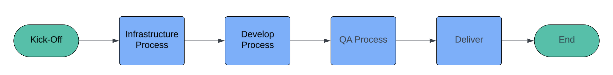

# Project Life-Circle

> Project Life-life circle là vòng đời của một dự án (hoặc một Version), Để làm tốt dự án, hãy đảm bảo bạn và các thành viên trong nhóm hiểu được quy trình này.

> Project Life-Cirle (Vòng đời dự án ) là các **điểm chạm quan trọng** với khách hàng và Team members. Các điểm này giúp Quản lý dự án tập trung hơn vào các task quy trình (Process Tasks).

**Architect -> Kick-off -> Infrastructure -> Delivery**

**Project Live Circle Overviews:**

<figure><figcaption></figcaption></figure>

**Architect:** Là hoạt động thống nhất về công nghệ, kiến trúc dự án, cài đặt hạ tầng.

**Kick-off**: Là hoạt động settup trước khi dự án bắt đầu. Bao gồm Khách hàng và team member nhằm settup mục tiêu, timeline, tinh thần của dự án.

**Delivery:** Là hoạt động report hàng ngày / Hàng tuần bao gồm **Daily Meeting** và **Release**

**Terminate:** Là hoạt động kết thúc dự án. Nhằm mục đích bàn giao và kết thúc một dự án.\

> Q: Dự án có nhiều Phases thì Life-Circle được chia như thế nào?

> A: Mỗi một Phase cần có một kick-off từ đầu và đó được coi là 1 vòng đời dự án.
